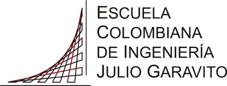
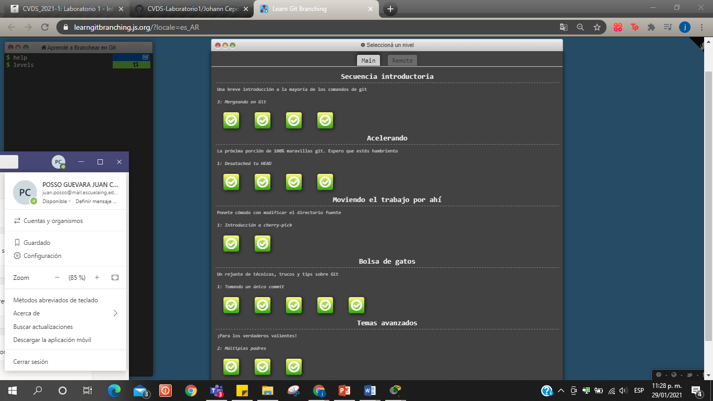
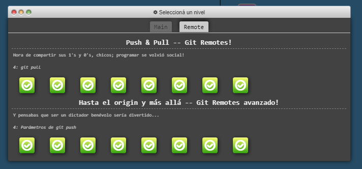

<h1 align="center"">A cerca de mí...</h1>

Mi nombre es *juan camilo* y tengo 21 años .\
Pertenezco al programa de ingenieria de sistemas de la [Escuela Colombiana de Ingenieria Julio Garavito](https://www.escuelaing.edu.co/es/) y estoy en ***Octavo semestre***
Actualmente  tengo conocimientos en desarrollo web : Front End Knockout.Js ,JQuery, css, javascript,html y  manejo de bases de datos.Nací en Cali y actualmente vivo al suroccidente de la ciudad y siempre busco dar lo mejor de mí.

## Habilidades y fortalezas🚀

_Mis habilidades y fortalezas son:_
* Disciplina
* Liderazgo
* Responsabilidad
* Honestidad
* Integro
* Tolerante

### Pasatiempos 📋

_Mis pasatiempos son:_
1. Dibujar
2. Programar
3. Pintar
4. Jugar ajedrés.
5. Compartir con mi familia.

### Learn Git Branching:
* 1ra Sección **main**\


* 2da Sección **remote**\


## Autores ✒️

* **Juan Camilo PossoG.** - *Initial work* - [JCPosso](https://github.com/JCPosso)

## Referencias
* https://learngitbranching.js.org/
* https://git-scm.com/doc
* http://ndpsoftware.com/git-cheatsheet.html
* https://commonmark.org/help/tutorial/
* https://git-scm.com/docs/git-init

```
 <script>
  
    alert( 'Piensa, Actúa,Evalúa,Adáptate!. Bill Gates>!' );
    
 </script>

```
